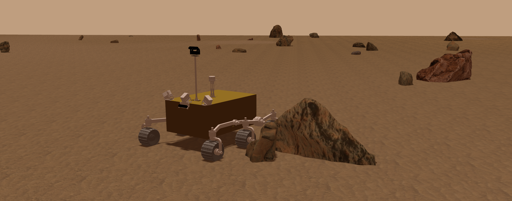

<!-- MarsSim 中文说明与安装使用指南。 -->
# MarsSim

## 概述
MarsSim 是一个基于 ROS + Gazebo 的火星车仿真与地形/岩石场景生成工程，包含：
- 地形高度图/纹理/语义类图生成
- 岩石分布与模型生成
- Terramechanics 插件(读取 DTM 文件)驱动轮地交互
- RViz 可视化与相机/传感器话题
<div align="center" style="margin: 20px 0;">
  
</div>


## 环境依赖
- Ubuntu 20.04
- ROS Noetic
- Gazebo(随 ROS Noetic)
- Python3
- Python 包：`pyyaml`, `opencv-python`, `numpy`, `pandas`, `hydra-core`, `omegaconf`

## Quickstart(推荐)
### 1) 克隆并编译
```bash
mkdir -p MarsSim_ws/src && cd MarsSim_ws
git clone git@github.com:WMR-team/MarsSim.git ./src/MarsSim
catkin build
source ./devel/setup.bash
```

### 2) 安装 Python 依赖
```bash
python3 -m pip install pyyaml opencv-python numpy pandas hydra-core omegaconf
```

### 3) 下载并安装模型资源(自动)
模型资源不直接入库(体积较大)。请使用脚本自动下载并解压:

```bash
cd ./src/MarsSim
python3 -m world_plugins.scripts.download_models --gdrive-file-id 1WT5JkZ87SlinNSlQP95LfcPy7OwLVmif
```

如果无法使用脚本自动下载，请在如下的网盘链接下载 `models.zip` 压缩包并手动解压至 `<repo>/rover_gazebo/models/` 目录下:
- [Google Drive](https://drive.google.com/file/d/1WT5JkZ87SlinNSlQP95LfcPy7OwLVmif/view?usp=drive_link)
- [百度网盘](https://pan.baidu.com/s/1wRg5N2Vxj_nuMMZaTU_9PA?pwd=1234)

模型解压后的期望结构(示例)：
```txt
MarsSim
├── rover_gazebo
│   ├── models
│   │   ├── mars_terrain
│   │   ├── mars_rocks_lbl
│   │   ├── ai_camera
│   │   └── ...
│   └── ...
└── world_plugins
    └── ...
```

### 4) 生成地形与场景
```bash
cd ./src/MarsSim
python3 -m world_plugins.scripts.world_change_pipeline
```

### 5) 启动仿真(任选其一)
```bash
# go back to your MarsSim_ws ros workspace
cd ../..
# 高保真场景
roslaunch rover_gazebo zhurong_main_real.launch

# 简单场景
roslaunch rover_gazebo zhurong_main_simple.launch
```

### 6) 键盘控制火星车移动
我们使用`teleop-twist-keyboard`包发布`/mars_environment/cmd_vel`消息控制轮式机器人运动
```shell
sudo apt install ros-noetic-teleop-twist-keyboard
```
请启动一个新的终端：
```shell
cd your-folder-path/MarsSim_ws
source devel/setup.bash
roslaunch rover_control teleop_keyboard.launch
```
在terminal窗口中输入如下键盘控制指令, 控制火星车移动:
- `i`: 前进
- `,`: 后退
- `j`: 左转
- `l`: 右转
- `k`: 停止
更具体的:
```
Reading from the keyboard  and Publishing to Twist!
---------------------------
Moving around:
   u    i    o
   j    k    l
   m    ,    .

q/z : increase/decrease max speeds by 10%
w/x : increase/decrease only linear speed by 10%
e/c : increase/decrease only angular speed by 10%
anything else : stop
```


## 开发与贡献
### 代码格式化
- Python：`black`
- C/C++：`clang-format`
- 建议启用 pre-commit(提交时自动格式化/检查)：
```bash
pip install pre-commit
pre-commit install
```

## 引用
```
@InProceedings{,
	author    = {},
	title     = {{}},
	booktitle = {{}},
	year      = {}
}
```

# DONE:
- 绝对路径
- world文件云下载，脚本
- 配置文件()
- 代码规范(py and cpp)
- log(hydra)
- CI/CD检查


# TODO:
- 配置文件的README
- 每次生成的时候会根据日期保存一个生成后的结果，另外一边在加载的时候加载的默认是最新的，但是之前的也不会消失，可以通过一些方式自己执行需要加载哪一次的结果
  - 把生成内容的文件夹进行统一，统一到一个临时生成的文件夹中，然后每一个文件夹的名字是开始生成的日期和时间，然后有一个链接是每次把最新的一个日期给软链到最新生成的一个文件夹内
- 场景自主生成(simple的进来和实际的对不上，main是固定的， 想要直接就能生成+打开一套，不弄那么复杂)
- 数据采集的脚本
  - 具体的数据采集形式需要固定
  - 可能是一个简单的TUI界面
- 需要有一个可视化的界面
  - 这个界面现在有一个方案是用Qt做的，但是问题是可能不能够在另外一台机器上进行显示
  - 要不然就是用rerun做，但是rerun上面的回传?
  - 这个界面最好能够开一个模块，这个模块负责接收手柄的消息or导航代码的消息，然后可以根据界面上的选择把最终选择的消息发给车的/cmd_vel，类似一个选择开关的作用
- 画一个模块化的框图

# BUG:
- 车一跑到边上就死了，就segmentation fault了
- 三轮车的模型好像有问题
