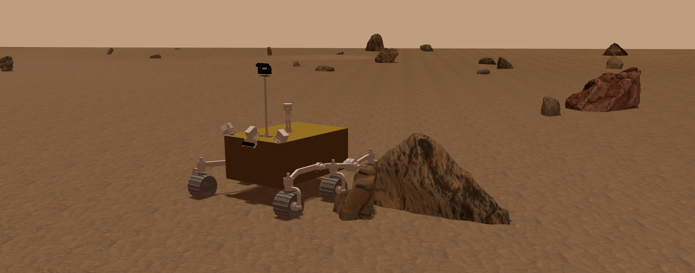

<!-- English documentation for MarsSim_v2 (ROS + Gazebo). -->
# MarsSim_v2

## Overview
MarsSim_v2 is a ROS + Gazebo simulation project for Mars rover scenarios and terrain/rock world generation, including:
- Terrain heightmap / texture / semantic class-map generation
- Rock distribution and model generation
- Terramechanics plugin (reads DTM files) for wheel–terrain interaction
- RViz visualization and camera/sensor topics

<div align="center" style="margin: 20px 0;">
  
</div>

## Requirements
- Ubuntu 20.04
- ROS Noetic
- Gazebo (via ROS Noetic)
- Python 3
- Python packages: `pyyaml`, `opencv-python`, `numpy`, `pandas`, `hydra-core`, `omegaconf`

## Quickstart (recommended)

### 1) Clone & build
```bash
mkdir -p MarsSim_ws/src && cd MarsSim_ws
git clone git@github.com:WMR-team/MarsSim.git ./src/MarsSim
catkin build
source ./devel/setup.bash
```

### 2) Install Python dependencies
```bash
python3 -m pip install pyyaml opencv-python numpy pandas hydra-core omegaconf
```

### 3) Download & install model assets (auto)
Model assets are not committed to the repository (large size). Use the script below to download and extract into:
`<repo>/rover_gazebo/models/`

```bash
cd ./src/MarsSim
python3 -m world_plugins.scripts.download_models --gdrive-file-id 1WT5JkZ87SlinNSlQP95LfcPy7OwLVmif
```

If the script cannot be used, download the `models.zip` from the links below and manually extract to:
`<repo>/rover_gazebo/models/`

Expected layout after extraction:
```txt
MarsSim
├── rover_gazebo
│   ├── models
│   │   ├── mars_terrain
│   │   ├── mars_rocks_lbl
│   │   ├── ai_camera
│   │   └── ...
│   └── ...
└── world_plugins
    └── ...
```

Links:
- Google Drive: https://drive.google.com/file/d/1WT5JkZ87SlinNSlQP95LfcPy7OwLVmif/view?usp=drive_link
- Baidu Netdisk: https://pan.baidu.com/s/1wRg5N2Vxj_nuMMZaTU_9PA?pwd=1234

### 4) Generate terrain & world assets
```bash
cd ./src/MarsSim
python3 -m world_plugins.scripts.world_change_pipeline
```

### 5) Launch simulation (pick one)
```bash
# High-fidelity scene
roslaunch rover_gazebo zhurong_main_real.launch

# Simple scene
roslaunch rover_gazebo zhurong_main_simple.launch
```

## Troubleshooting
### Gazebo cannot find models (`model://xxx` not found)
Ensure `rover_gazebo/models` is in the Gazebo search path:
```bash
export GAZEBO_MODEL_PATH=$PWD/src/MarsSim/rover_gazebo/models:${GAZEBO_MODEL_PATH}
```

### Terramechanics plugin cannot open the DTM file
`TerrainMapFileName` in:
`rover_gazebo_plugins/config/TerramechanicsPluginParam.yaml`
should be a repo-relative path (e.g. `rover_gazebo/data/simulated_terrain_data.txt`), and the plugin should resolve it reliably at runtime.

## Development & contributing
### Formatting
- Python: `black`
- C/C++: `clang-format`
- Recommended: enable `pre-commit` hooks:
```bash
pip install pre-commit
pre-commit install
```

## Citation
```bibtex
@InProceedings{,
  author    = {},
  title     = {{}},
  booktitle = {{}},
  year      = {}
}
```

## TODO
- Remove remaining absolute paths
- Cloud download scripts for world/models
- Config cleanup
- Code style improvements (Python/C++)
- Hydra logging
- Data collection utilities
